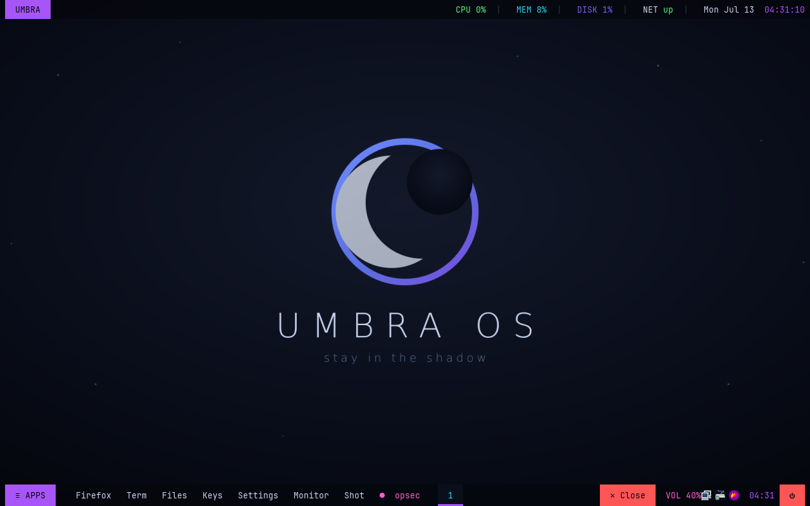
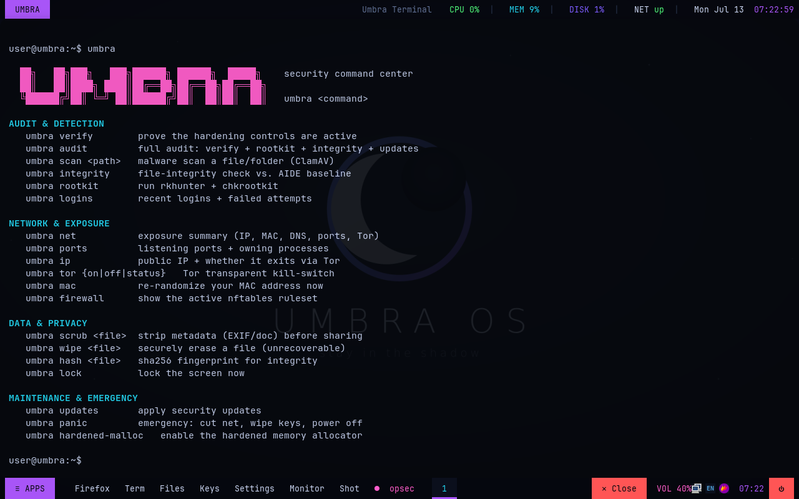
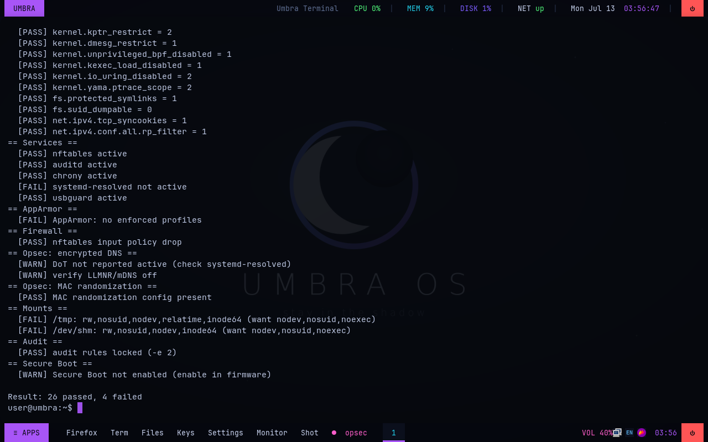

<div align="center">

# Umbra OS

**A hardened, privacy-first Linux distribution — *stay in the shadow.***

Debian trixie · KSPP-hardened kernel · opsec by default · i3 tiling desktop



</div>

---

## What is Umbra OS?

Umbra OS is a security- and privacy-focused Linux distribution built on **Debian (trixie)** with
[`live-build`](https://wiki.debian.org/DebianLive). It layers an aggressively hardened system
(kernel lockdown, mandatory access control, a curated auditd ruleset, default-deny firewall,
LUKS-ready) with an **operational-security layer** (MAC-address randomization, encrypted DNS,
metadata scrubbing, a Tor kill-switch, a panic wipe) — and ships it on a custom **i3 tiling
desktop** that looks nothing like a stock distro.

It does everything a normal computer does — the apps all work — but it is built like a vault.

> **Honest framing.** If your threat model is *anonymity*, use [Tails](https://tails.net/) or
> [Whonix](https://www.whonix.org/). If it's hardware-enforced compartmentalization, use
> [Qubes OS](https://www.qubes-os.org/). Umbra takes the practical middle path: a genuinely usable,
> aggressively hardened monolithic system you can daily-drive.

---

## Highlights

| | |
|---|---|
| 🛡️ **Hardened kernel** | Full KSPP command line — `slab_nomerge`, `init_on_alloc/free`, `pti`, `lockdown=confidentiality`, `mitigations=auto,nosmt`, signed modules, io_uring off, `randomize_kstack_offset`… applied to **both** the live image and installs |
| 🔒 **~45 sysctls** | kptr/dmesg restrict, unprivileged BPF & userfaultfd off, ptrace restricted, kexec off, full ASLR, anti-spoofing network stack |
| 🧱 **MAC + firewall** | AppArmor enforced, nftables default-deny inbound, USBGuard device allow-listing |
| 🕵️ **Opsec by default** | MAC randomization, RFC-7844 DHCP anonymity, DNS-over-TLS (Quad9), no LLMNR/mDNS, IPv6 privacy addrs, hardened Firefox, UTC clock, generic hostname |
| 🧅 **Tor kill-switch** | Opt-in transparent proxy — routes everything through Tor and **fails closed** on leaks |
| 💣 **Panic wipe** | One command cuts the network, evicts the LUKS key from RAM, and hard-powers-off |
| 🔎 **Detection** | auditd (immutable ruleset), AIDE, Lynis, rkhunter, chkrootkit, ClamAV, unattended security upgrades |
| 🖥️ **i3 tiling desktop** | Neon-on-black rice: polybar top bar + a mouse-drivable bottom taskbar, rofi, picom, alacritty, the Umbra eclipse branding |
| ⌨️ **`umbra` command** | A unified security command center (see below) |

---

## The `umbra` command center

Type `umbra` in any terminal (or click the **● opsec** taskbar button / **Umbra Security Center**
in the app menu) for the full menu:



```
AUDIT & DETECTION
   umbra verify        prove the hardening controls are active
   umbra audit         full audit: verify + rootkit + integrity + updates
   umbra scan <path>   malware scan a file/folder (ClamAV)
   umbra integrity     file-integrity check vs. AIDE baseline
   umbra rootkit       run rkhunter + chkrootkit
   umbra logins        recent logins + failed attempts

NETWORK & EXPOSURE
   umbra net            exposure summary (IP, MAC, DNS, ports, Tor)
   umbra ports          listening ports + owning processes
   umbra ip             public IP + whether it exits via Tor
   umbra tor {on|off|status}   Tor transparent kill-switch
   umbra vpn <conf>     WireGuard kill-switch (egress only via the tunnel)
   umbra mac            re-randomize your MAC address now
   umbra firewall       show the active nftables ruleset

DATA & PRIVACY
   umbra scrub <file>   strip metadata (EXIF/doc) before sharing
   umbra wipe <file>    securely erase a file (unrecoverable)
   umbra encrypt <file> encrypt a file with a passphrase (age)
   umbra decrypt <file> decrypt a .age file
   umbra hash <file>    sha256 fingerprint for integrity
   umbra lock           lock the screen now

KNOW-HOW
   umbra tip            a daily operational-security tip (--all to browse)

MAINTENANCE & EMERGENCY
   umbra updates        apply security updates
   umbra panic          emergency: cut net, wipe keys, power off
   umbra hardened-malloc   toggle the hardened memory allocator
```

---

## Verify it yourself

`umbra verify` (or `sudo umbra-verify.sh`) checks ~30 controls and reports PASS/FAIL:



A few checks intentionally only pass on an **installed** system (mount options come from
`umbra-harden-install.sh`; Secure Boot is a firmware setting) — those are noted, not bugs.

---

## Building the ISO

You need a Linux build environment. From **Windows**, the easiest path is Docker Desktop:

```bash
./build-in-docker.sh          # -> out/umbra-os-amd64.hybrid.iso  (~2.7 GB)
```

On **Debian/Ubuntu/WSL2**:

```bash
sudo apt install live-build
sudo ./build.sh
```

The build runs entirely inside a Debian container/chroot; only the finished ISO is written to
`out/`. A SHA-256 sum is produced alongside it.

## Testing

- **QEMU:** `qemu-system-x86_64 -machine q35 -m 4096 -cdrom out/umbra-os-amd64.hybrid.iso …`
- **VirtualBox:** create a VM (Debian 64-bit, 4 GB RAM, 128 MB VRAM, 3D accel), attach the ISO,
  boot. It **auto-logs into the i3 desktop**.

> The hardened boot (`init_on_alloc/free`, `nosmt`) is noticeably slower than a stock distro —
> that's the memory-zeroing and side-channel mitigations doing their job.

## Installing

1. Boot the ISO → run the Debian installer → **"Guided – encrypted LVM"** (LUKS2). Use a long
   diceware passphrase.
2. First boot, apply the post-install hardening:
   ```bash
   sudo umbra-harden-install.sh                    # mounts, USBGuard, AIDE
   sudo umbra-harden-install.sh --paranoid --hidepid --no-camera   # optional extras
   ```
3. Verify: `sudo umbra-verify.sh` (expect a clean pass), optionally `sudo lynis audit system`.

### Firmware prerequisites (no distro can do these for you)
- Enable **UEFI Secure Boot** (Debian's signed shim works out of the box)
- Set a **firmware/BIOS password**, disable external boot
- Keep microcode/firmware current (`fwupdmgr`)

---

## Desktop cheatsheet (i3)

Super = the ⊞ key. **In VirtualBox the host often eats the Super key — use the bottom taskbar
(≡ APPS, quick-launch buttons, ✕ Close) which is fully mouse-drivable.**

| Key | Action |
|---|---|
| `Super+Return` | terminal (alacritty) |
| `Super+d` | app launcher (rofi) |
| `Super+q` | close window (or click **✕ Close** on the taskbar) |
| `Super+g / n / p` | Firefox / Files / KeePassXC |
| `Super+1..9` | switch workspace |
| `Super+Shift+/` | keybinding help |

Close a terminal with `exit` / `Ctrl+D`; most apps with `Ctrl+Q`.

---

## Repository layout

```
umbra-os/
├── build.sh · build-in-docker.sh · container-build.sh   # build the ISO
├── config/                        # live-build tree (baked into the image)
│   ├── package-lists/             # the package set
│   ├── hooks/normal/              # hardening · branding · session · premium hooks
│   └── includes.chroot/           # every /etc & /usr file: sysctl, grub, nftables,
│                                  #   audit, pam, i3, polybar, rofi, picom, alacritty,
│                                  #   dunst, lightdm, the umbra command, …
├── branding/                      # eclipse logo + wallpaper (SVG)
└── docs/
    ├── HARDENING.md               # every hardening control, rationale, and trade-off
    ├── OPSEC.md                   # the opsec/anonymity layer and its honest limits
    └── screenshots/
```

## Documentation
- **[docs/HARDENING.md](docs/HARDENING.md)** — every hardening control, why it exists, and what it breaks.
- **[docs/OPSEC.md](docs/OPSEC.md)** — the opsec layer, the Tor kill-switch design, and its limits.

## Known limitations
- **hardened_malloc** ships pre-built (a portable, `CONFIG_NATIVE=false` shared object vendored in
  the repo), so it is always enabled. The optional **Graphite GTK theme** is still built at image
  time and needs the network; if it's unavailable the build falls back to the packaged
  Yaru-purple-dark theme.
- The **live ISO boot menu** still shows Debian's default splash (the installed system's GRUB is
  themed).
- **VirtualBox** may not forward the Super key to the guest — the taskbar (≡ APPS, quick-launch,
  ✕ Close) is the mouse-driven fallback.

## Not a goal
Not Tails (Umbra is persistent, not amnesic). Not Whonix (same-host Tor is weaker than an isolated
gateway). Not disk anti-forensics (`umbra panic` protects the *key in RAM*, relying on LUKS at rest).

## License
[MIT](LICENSE) for the Umbra OS build scripts and configuration. The resulting image bundles
Debian and other upstream software under their respective licenses.

## Disclaimer
Umbra OS is a defensive, personal-hardening project provided as-is, with no warranty. Security is
a process, not a product — the strongest control is still a careful operator.
